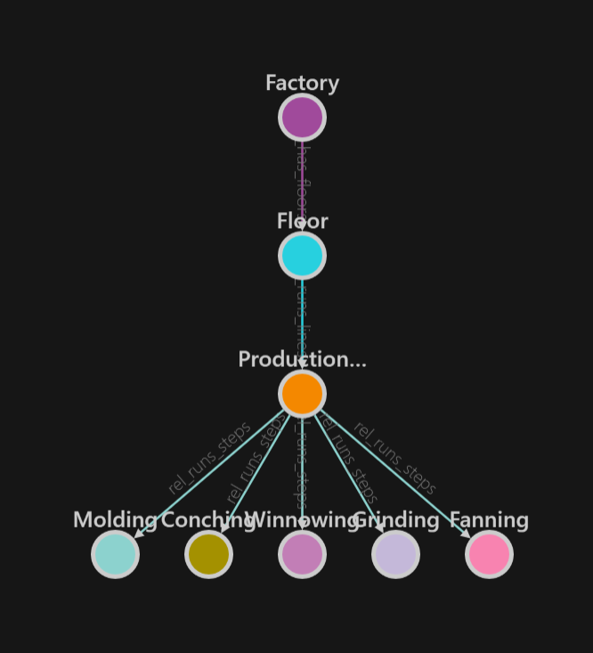

# Communicator ADT Tutorial

Shows a basic connection between the [HOOPS Web Platform](https://www.techsoft3d.com/products/hoops/web-platform/) and [Azure Digital Twin](https://azure.microsoft.com/en-us/services/digital-twins/) (ADT).

The web application polls the ADT graph every five seconds and displays metadata for each machine in a chocolate factory processing line. If the vibrational value of the grinder goes above 300, the machine is highlighted. Alerts can be triggered and reset from the UI to simulate a real-life scenario.

## Live Demo

Our **live demo** is running at: https://adt-communicator.azurewebsites.net 

## Requirements

Node.js 17.0.1 \
Azure Digital Twins \
Azure Active Directory

## Architecture

The complete architecture of this application is shown below. This repository contains only the frontend web app and the backend node server. Azure services will need to be setup separately for this app to work. (See "Getting Started" below)
* /src contains the code for the frontend application. /src/index.html is based on hoop_web_viewer_sample.html from the HOOPS Web Platform installation with small edits to show demo functionality.
* /objects.json contains the mapping between ADT objects and the CAD models, as well as the 3D world transforms to place the objects (since ADT does not contain this information)
* /app.js is a Node.js Express server that serves the frontend application, authenticates and interacts with the ADT graph.

## Getting Started

### Setting Up the ADT Graph

* Create and set up a new Azure Digital Instance using the DTDL models we provided in the /digital_twin_models folder. If you are familiar with Azure digital twin, feel free to skip to the next step to set up the authentication. 

* You can follow the LabSetup steps from this [HandsOnLab by Microsoft](https://github.com/Azure-Samples/digital-twins-samples/tree/master/HandsOnLab), which utilizes Azure CLI. Alternatively, Azure also provides a graphical tool called "Azure Digital Twins Explorer" for setting up and managing Azure Digital Twins. After a new Azure Digital Twin instance is created, this tool can be accessed from your Azure Portal by clicking (Your New Instance) > Overview > Open Azure Digital Twins Explorer.

* (Note) Our models are built based on the HandsOnLab from Microsoft with some adjustments to the DTDL files. Compared to the Microsoft tutorial, there are more production steps and each production step has two additional properties: *SCSFile* and *Trans  formation*. The default values we use for this demo can be found in */twins-init.js*, which will be automatically uploaded when you first-time launch this web app.
  
* This is what the ADT graph would like like after the setup:

  

### Setting Up the Authentication

* (Note) This application adopts the [Client Credentials Flow](https://docs.microsoft.com/en-us/azure/active-directory/develop/v2-oauth2-client-creds-grant-flow) to authenticate with the Microsoft Identity Platform. It allows our node server to authenticate on behalf of a daemon application instead of a user. Therefore, for this demonstration, users will not need to sign in on the frontend app, and all users accessing this application will utilize the same authentication and authorization on the backend node server.

* To use REST API with your digital twin, please register your app following this [tutorial from Microsoft](./readme_assets/use-rest-apis.pdf). Please make sure you have the *tenant_id*, *client_id/app_id*, *client_secret/password*, and *hostname*.

* Update fields in */adt.config.js* to accordingly.

### Running the demo

`npm install`

`node app.js`

Open a browswer window and navigate to http://localhost:3000/

## Depolying the demo

Before deploying this app, please make sure to change the *serverUrl* in */src/js/adt_helper.js* to match your deployment URL.

## Todo

1. Remove dependance on app.js to relay requests to ADT api but instead use a proxy severvice like ADT_Explorer does
2. Remove 5 second polling and replace with real time SingalR updates
3. Add a UI to represent the ADT graph and enable bidirectional selection between 3d and the graph
4. Instructions for deploying on a azure server
5. Home button needs to zoom to extents of all models loaded, not just the first one

## Data Credits

[Microsoft HandsOnLab](https://github.com/Azure-Samples/digital-twins-samples/tree/master/HandsOnLab)
[Murdianto](https://grabcad.com/murdianto-1)
[Hashim Khan](https://grabcad.com/hashim.khan-6)
[quy49ctu](https://grabcad.com/quy49ctu-1)
[Erkan](https://grabcad.com/erkan--4)
[nowa](https://grabcad.com/nowa-1)
